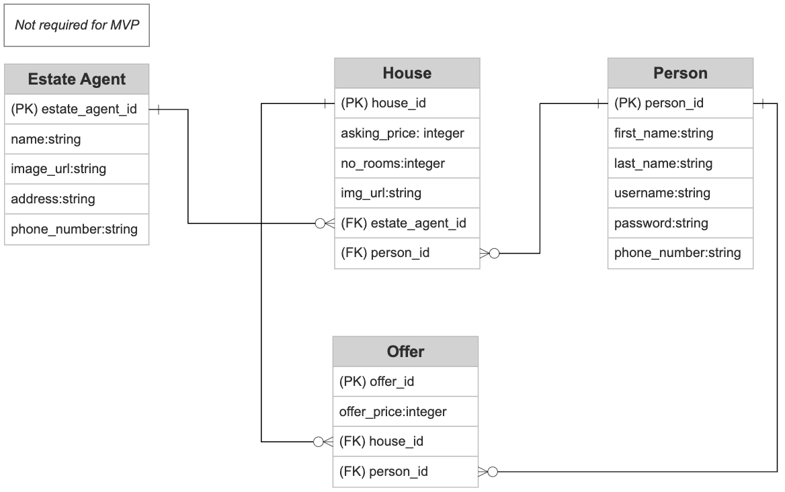

# Property App

## App Overview

### MVP

- A property listing website where users can:
    - upload properties to sell
    - make offers on properties already posted on the site

### Stretch

- Estate agents can be associated with the property

## Stack

We plan on using Ruby on Rails API with a React frontend.

We will have full CRUD on Property and Offer models.

## User Stories

### MVP

- [ ] As a user, I want to sign up so that I can create an account
- [ ] As a user, I want to edit my profile so that I can change my details
- [ ] As a user, I want to login so that I can access the app
- [ ] As a user, I want to add a property that I own so that I can list a property on the app
- [ ] As a user, I want to delete a property that I own so that I can remove it from the listing on the app
- [ ] As a user, I want to edit a property that I own so that I can make changes to the property details
- [ ] As a user, I want to add offers on properties so that I can buy them
- [ ] As a user, I want to delete offers on properties so that I can remove offers made
- [ ] As a user, I want to edit offers on properties so that I can change the offer details
- [ ] As a user, I want to view my properties so that I can see what I have listed
- [ ] As a user, I want to view my offers so that I can see what offers I have made

## Wireframes

## Entity Relationship Diagram

