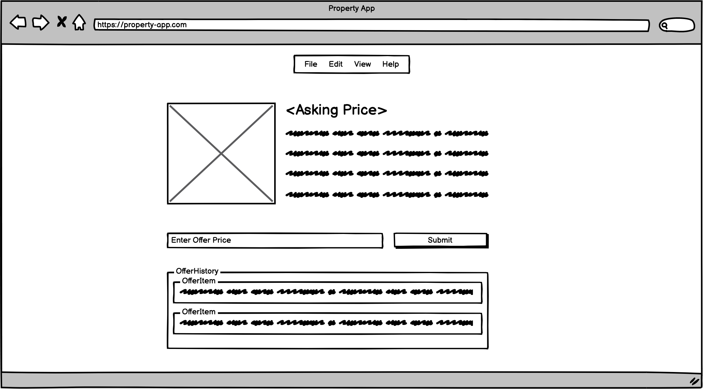

# Property App

## App Overview

### MVP

- A property listing website where users can:
    - upload properties to sell
    - make offers on properties already posted on the site

### Stretch

- Estate agents can be associated with the property

## Stack

We plan on using Ruby on Rails API with a React frontend.

We will have full CRUD on Property and Offer models.

## User Stories

### MVP

- [ ] A user 

## Wireframes

## Entity Relationship Diagram

